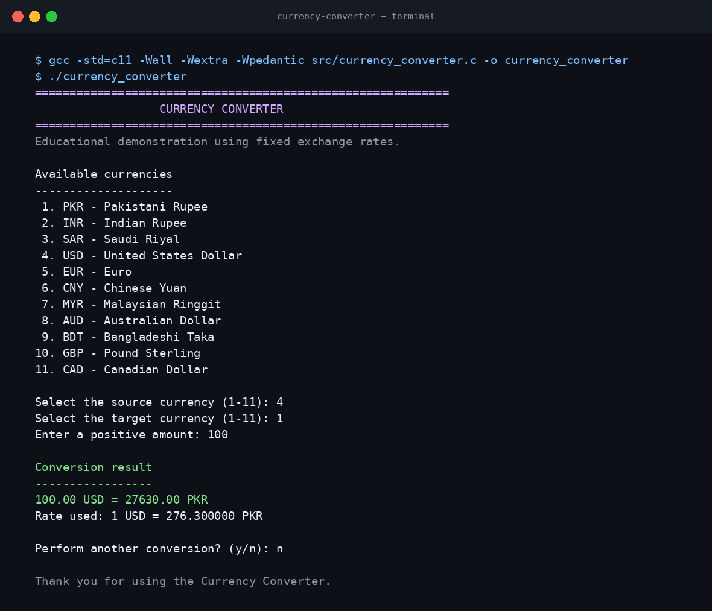

# Currency Converter in C

A menu-driven console application that converts amounts between 11 currencies
using fixed exchange rates. This project was originally developed during the
first semester of an Introduction to Programming course and was later cleaned
for portability, safer input handling, and clear documentation.



## Academic Context

| Item | Details |
| --- | --- |
| Author | Toufique Ahmed |
| Course | Introduction to Programming |
| Semester | First semester |
| Year | 2022 |
| Institution | Quaid-e-Awam University of Engineering, Science and Technology (QUEST), Nawabshah |
| Language | C |

## Features

- Converts between 11 supported currencies in 110 directions.
- Uses a clear numbered menu for source and target selection.
- Rejects invalid menu choices, non-numeric input, and non-positive amounts.
- Allows multiple conversions in one program session.
- Saves conversion details and a timestamp to a local `History.txt` file.
- Uses only the C standard library and compiles on Windows, Linux, and macOS
  with a standard C compiler.

## Supported Currencies

| Code | Currency |
| --- | --- |
| PKR | Pakistani Rupee |
| INR | Indian Rupee |
| SAR | Saudi Riyal |
| USD | United States Dollar |
| EUR | Euro |
| CNY | Chinese Yuan |
| MYR | Malaysian Ringgit |
| AUD | Australian Dollar |
| BDT | Bangladeshi Taka |
| GBP | Pound Sterling |
| CAD | Canadian Dollar |

## Project Structure

```text
currency-converter-in-c/
├── src/
│   └── currency_converter.c
├── screenshots/
│   └── program-demo.png
├── .gitignore
├── LICENSE
└── README.md
```

## Build and Run

### Requirements

- A C compiler with C11 support, such as GCC or Clang.

### Linux or macOS

From the repository root, run:

```bash
gcc -std=c11 -Wall -Wextra -Wpedantic src/currency_converter.c -o currency_converter
./currency_converter
```

### Windows with MinGW GCC

From the repository root, run:

```powershell
gcc -std=c11 -Wall -Wextra -Wpedantic src\currency_converter.c -o currency_converter.exe
.\currency_converter.exe
```

## Example

```text
Select the source currency (1-11): 4
Select the target currency (1-11): 1
Enter a positive amount: 100

Conversion result
-----------------
100.00 USD = 27630.00 PKR
Rate used: 1 USD = 276.300000 PKR
```

After a successful conversion, the program creates or updates `History.txt` in
the current working directory. This generated file is excluded from Git so
that local usage history is not published.

## Important Rate Notice

The program uses the fixed educational exchange-rate values retained from the
original 2022 project. It does not connect to a live exchange-rate service, so
its results must not be used for trading, banking, travel budgeting, or other
real financial decisions.

## Improvements Made for This Repository

The original project idea and rate data were preserved. The public repository
version includes the following presentation and reliability improvements:

- Removed the unused, non-standard `conio.h` dependency.
- Corrected currency codes, spelling, and filenames.
- Replaced repeated conversion functions with one table-driven conversion
  flow.
- Added safe parsing and validation for menu choices and amounts.
- Replaced the uninitialized result variable with direct calculations.
- Added error handling for the history file.
- Removed the collection of names and ages from conversion history.
- Added portable build instructions and strict compiler checks.

## Learning Outcomes

This project demonstrates foundational C programming concepts, including:

- Variables and data types
- Arrays and structures
- Functions and function prototypes
- Loops and conditional statements
- File handling
- Input validation
- Modular program organization

## Possible Future Improvements

- Retrieve current rates from a trusted exchange-rate API.
- Let users update or import rates from a data file.
- Add automated unit tests for the conversion table.
- Add a graphical or web-based interface.

## License

This project is available under the [MIT License](LICENSE).

